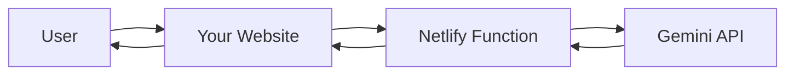

# Netlify Function Setup for Yikes AI Chatbot

## 🚀 Overview

This setup uses **Netlify Functions** to securely proxy requests to the Gemini AI API, eliminating CORS issues and keeping your API key secure on the server-side.

## 📋 Setup Steps

### 1. Environment Variable Configuration

In your Netlify dashboard:

1. Go to **Site settings** → **Environment variables**
2. Add a new environment variable:
   - **Key**: `GEMINI_API_KEY`
   - **Value**: Your actual Gemini API key (starts with `AIzaSy...`)
   - **Scopes**: Check "Production" and "Deploy previews"

### 2. Deploy Structure

Your repository should have this structure:
```
your-project/
├── netlify/
│   └── functions/
│       └── gemini-chat.js        # ✅ Created
├── js/
│   └── chatbotWidget.js          # ✅ Updated
├── netlify.toml                  # ✅ Updated
└── your-html-files...
```

### 3. Function Endpoint

Once deployed, your function will be available at:
```
https://your-site.netlify.app/.netlify/functions/gemini-chat
```

The chatbot automatically calls this endpoint - no configuration needed!

## 🔒 Security Benefits

✅ **API Key Protection**: Your Gemini API key never appears in client-side code  
✅ **CORS Resolved**: No cross-origin issues since requests go to your own domain  
✅ **Rate Limiting**: You control usage and can add limits if needed  
✅ **Cost Control**: Only your traffic uses your API quota  

## 🛠️ How It Works



1. User types message in chatbot
2. Frontend sends request to `/.netlify/functions/gemini-chat`
3. Netlify Function receives request with message
4. Function calls Gemini API using secure server-side API key
5. Function returns AI response to frontend
6. Chatbot displays response to user

## 🧪 Testing

After deployment, test the function directly:

```bash
curl -X POST https://your-site.netlify.app/.netlify/functions/gemini-chat \
  -H "Content-Type: application/json" \
  -d '{"message": "How do I add shares to my cap table?"}'
```

Expected response:
```json
{
  "response": "To add shares to your cap table:\n\n• Navigate to...",
  "source": "gemini-ai"
}
```

## 🚨 Troubleshooting

### Function Not Found (404)
- Check that `netlify/functions/gemini-chat.js` exists
- Verify `netlify.toml` has functions directory configured
- Redeploy the site

### API Key Error (500)
- Verify `GEMINI_API_KEY` is set in Netlify environment variables
- Check that the key starts with `AIzaSy` and is valid
- Redeploy after adding environment variables

### CORS Errors
- Update CSP in `netlify.toml` to allow function calls
- Ensure requests go to `/.netlify/functions/gemini-chat` (relative path)

### Chatbot Shows "Knowledge Base Mode"
- Check browser console for function call errors
- Verify function is deployed and responding
- Test function endpoint directly

## 📊 Monitoring

Monitor function usage in Netlify dashboard:
- **Functions** tab shows invocations and errors
- **Deploy log** shows function deployment status
- **Site analytics** tracks overall usage

## 💰 Cost Considerations

- **Netlify Functions**: 125,000 requests/month free
- **Gemini API**: Pay-per-use based on your API plan
- **Function execution time**: ~1-3 seconds per AI request

## 🔄 Updates

To update the AI behavior:
1. Edit `netlify/functions/gemini-chat.js`
2. Modify the prompt or parameters
3. Commit and push - auto-deploys via Netlify

## ✅ Deployment Checklist

- [ ] `netlify/functions/gemini-chat.js` created
- [ ] `js/chatbotWidget.js` updated to use Netlify Function
- [ ] `netlify.toml` configured with functions directory
- [ ] `GEMINI_API_KEY` environment variable set in Netlify
- [ ] Site deployed and function accessible
- [ ] Chatbot shows "AI Mode Active"
- [ ] Test message receives AI response

---

**🎉 Once completed, your chatbot will have secure, serverless AI capabilities with no CORS issues and protected API keys!** 